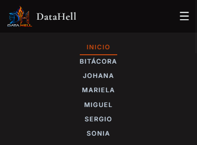
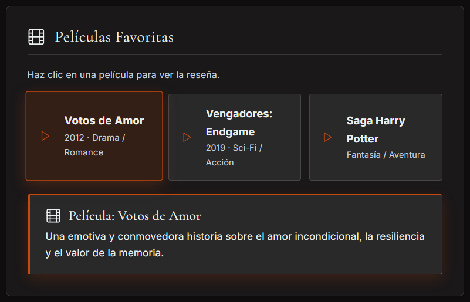
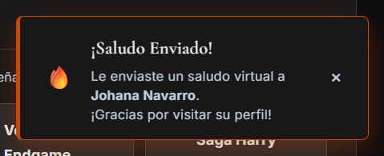
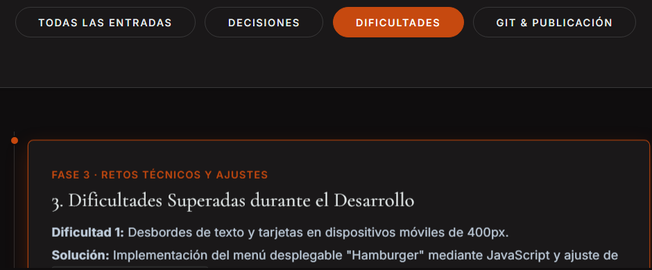

# Trabajo Práctico Grupal 1 - Equipo DataHell

Bienvenido/a al repositorio oficial del **Trabajo Práctico Grupal 1** para la materia "Desarrollo Web Frontend" del IFTS N°29.

---

## 1. Descripción del Proyecto

Este proyecto consiste en un sitio web grupal maquetado con **HTML5**, **CSS3** y **JavaScript** sin librerías externas pesadas, diseñado bajo una estética de elección colectiva y con cumplimiento estricto de accesibilidad **WCAG AAA**. 

Presenta una portada institucional del equipo, 5 páginas de perfil individual estructuradas, una sección de bitácora que registra el proceso colaborativo, y un diseño responsive adaptable ajustado a los breakpoints requeridos (400 px, 900 px y 1200 px).

---

## 2. Integrantes del Equipo (Orden Alfabético)

| Nombre y Apellido | Rol Principal | Ubicación | Perfil de GitHub / Redes |
| :--- | :--- | :--- | :--- |
| **Johana Navarro** | Lógica JS & Documentación / QA | Córdoba Capital (Córdoba) | [@johana-navarro](https://github.com/johana-navarro) |
| **Mariela Lorenzo** | Diseño UI/UX & Código - Creativa | Boedo (CABA) | [@MariuLorenzo](https://github.com/MariuLorenzo) |
| **Miguel Martínez** | Diseño Gráfico & Infraestructura IT | Bahía Blanca (BsAs)| [@mpmarcol](https://github.com/mpmarcol) |
| **Sergio Arenhardt** | Backend Dev & Bases de Datos | Eldorado (Misiones) | [@sealar24](https://github.com/sealar24) \| [LinkedIn](https://www.linkedin.com/in/sergio-alberto-arenhardt-8ba23a2a7/) |
| **Sonia Pereira** | Maquetado Web & Arquitectura | Belgrano, (CABA) | [@SoniaPe](https://github.com/SonyGahan) |

---

## 3. Publicación y Despliegue en Producción

* **Repositorio Oficial GitHub:** [https://github.com/cuartocuatrimestre2026-oss/TP1-FRONTEND-DATAHELL](https://github.com/cuartocuatrimestre2026-oss/TP1-FRONTEND-DATAHELL)
* **URL en Producción (GitHub Pages):** [https://cuartocuatrimestre2026-oss.github.io/TP1-FRONTEND-DATAHELL/](https://cuartocuatrimestre2026-oss.github.io/TP1-FRONTEND-DATAHELL/)
* **URL en Producción (Vercel):** [https://tp-1-frontend-datahell.vercel.app](https://tp-1-frontend-datahell.vercel.app) 

---

## 4. Tecnologías Utilizadas

* **HTML5 Semántico:** Estructura limpia y accesible (`header`, `nav`, `main`, `section`, `article`, `aside`, `footer`).
* **CSS3 Editorial Nativo:** Variables globales (`:root`), Flexbox, CSS Grid y micro-interacciones sutiles.
* **JavaScript ES6+:** Manipulación nativa del DOM y componentes reactivos context-aware.
* **Google Fonts:** Tipografías *Cormorant Garamond* (titulares elegantes) e *Inter* (cuerpo de texto de alta legibilidad).
* **Accesibilidad WCAG AAA:** Contrastes de texto optimizados (mínimo 7:1) y etiquetas ARIA.

---

## 5. Estructura de Archivos y Carpetas

```text
frontend-tp/
├── .gitignore              # Archivos y rutas excluidas del control de versiones
├── README.md               # Documentación técnica integral y rúbrica docente
├── index.html              # Portada principal del equipo (5 integrantes)
├── bitacora.html           # Bitácora de proceso y decisiones del grupo
├── perfil1.html            # Perfil individual de Johana Navarro
├── perfil2.html            # Perfil individual de Mariela Lorenzo
├── perfil3.html            # Perfil individual de Miguel Martínez
├── perfil4.html            # Perfil individual de Sergio Arenhardt
├── perfil5.html            # Perfil individual de Sonia Pereira
├── css/
│   └── styles.css          # Hoja de estilos global, sistema editorial y media queries
├── js/
│   ├── main.js             # Lógica de portada, frases aleatorias y menú hamburguesa
│   ├── perfil.js           # Lógica interactiva de los perfiles (reseñas inline y saludos)
│   └── bitacora.js         # Lógica de filtrado dinámico en la bitácora
└── img/
    ├── logo-DataHell.png   # Logotipo oficial PNG del equipo y favicon
    ├── Johana_avatar.jpg   # Avatar digital ilustrado con IA de Johana Navarro
    ├── Mariela_avatar.jpg  # Avatar digital ilustrado con IA de Mariela Lorenzo
    ├── Migue_avatar.jpeg   # Avatar digital ilustrado con IA de Miguel Martínez
    ├── Sergio_avatar.jpeg  # Avatar digital ilustrado con IA de Sergio Arenhardt
    ├── Sony_avatar.jpg     # Avatar digital ilustrado con IA de Sonia Pereira
    ├── DataHell_equipo.jpeg # Fotografía grupal del equipo DataHell
    └── capturas/           # Evidencia visual de interactividad JS y responsividad
        ├── js-portada-frase.png
        ├── js-portada-contador.png
        ├── js-menu-hamburguesa.png
        ├── js-perfil-resena.png
        ├── js-perfil-saludo-toast.png
        └── js-bitacora-filtro.png
```

---

## 6. Guía de Estilos & Identidad Visual

### Paleta de Colores Oficial DataHell (`:root`)
* **Texto Principal (`--ink`):** `#eaf0f0` (Blanco suave de alta legibilidad y contraste AAA)
* **Fondo de Página (`--pearl` / `--bg-page`):** `#0f0d0e` (Oscuro profundo editorial)
* **Color de Acento (`--accent-violet` / `--accent-orange`):** `#c6490f` (Terracota / Fuego vibrante)
* **Superficie de Tarjetas (`--snow` / `--bg-card`):** `#1a1819` (Gris oscuro elegante contrastante)
* **Fondo Citas & Medios (`--accent-violet-soft`):** `rgba(234, 240, 240, 0.08)` (Superficie suave para citas y reseñas)
* **Texto Secundario (`--slate`):** `#c2d0df` (Gris claro sobrio)
* **Bordes Neutros (`--mist`):** `rgba(234, 240, 240, 0.15)` (Líneas sutiles de separación)

### Tipografía
* **Titulares (`h1` - `h6`, `.profile-name`):** `'Cormorant Garamond', Georgia, serif`
* **Texto General & Interfaz:** `'Inter', sans-serif`

### Iconografía y Recursos Visuales
* **Iconos Monolineales Nativos (SVG y Unicode):** Se implementó iconografía vectorial SVG nativa y símbolos Unicode monolineales para la navegación rápida (`🡸`, `🡺`), menú responsive (`☰`), categorías multimedia (películas y álbumes musicales en las tarjetas de perfil) y notificaciones Toast (`🔥`), prescindiendo de librerías externas pesadas (como FontAwesome o Material Icons) para maximizar la velocidad de carga (Core Web Vitals) y conservar la estética editorial limpia.
* **Isologotipo Oficial y Favicon:** Logotipo del equipo DataHell diseñado bajo una estética *dark-tech* con flamas estilizadas, optimizado en formato PNG con fondo transparente e implementado como Favicon oficial en todas las vistas del sitio.

### Breakpoints Adaptativos y Ajustes Responsivos
* **400 px (Móvil pequeño y pantallas hasta 768px):** Menú hamburguesa interactivo (`☰`) alineado simétricamente con el límite derecho de la tarjeta principal (igualando los márgenes del logotipo a la izquierda), espaciados calibrados para lectura sin desbordes y maquetación en una sola columna fluida.
* **900 px (Tablets):** Disposición en 2 columnas para fichas de perfil, navegación superior compacta sin solapamiento entre la marca y los enlaces, y grillas adaptadas a pantallas táctiles intermedias.
* **1200 px (Laptops y Escritorio amplio):** Maquetación editorial completa en 3 columnas, transición fluida en el rango intermedio (901px a 1071px) con escalado de navegación para evitar colisiones, y contenedor principal centrado con límite de 1200px.

---

## 7. Funciones JavaScript e Interacciones Dinámicas

Conforme al requerimiento de la consigna y la rúbrica docente, se documentan las interacciones dinámicas implementadas con JavaScript nativo (ES6+), acompañadas de una breve explicación y su captura de pantalla demostrativa en funcionamiento:

### Portada (`index.html` - `js/main.js`)

1. **Generador de Frases Inspiradoras (`heroQuoteBtn`):**
   * **Explicación:** Al hacer clic en el botón *"Inspiración del Día"*, se selecciona aleatoriamente una cita del acervo del equipo evitando repeticiones inmediatas mediante un array de control de historial. El texto se renderiza con una transición suave de opacidad.
   * **Captura de Pantalla:**
     

2. **Contador Animado de Estadísticas (`stat-number`):**
   * **Explicación:** Utiliza la API nativa `IntersectionObserver` para detectar cuándo la sección de métricas entra en la pantalla del usuario. Al activarse, inicia un intervalo asíncrono que realiza un conteo progresivo hasta alcanzar los valores meta (5 integrantes, 25 habilidades y 100% de compromiso).
   * **Captura de Pantalla:**
     

3. **Menú Hamburguesa Adaptativo (`mobileMenuBtn`):**
   * **Explicación:** En dispositivos móviles y pantallas menores a 768px (calibrado a 400px), conmuta la clase `.show` sobre el contenedor de navegación y actualiza dinámicamente el atributo `aria-expanded` para accesibilidad táctil.
   * **Captura de Pantalla:**
     

### Perfiles Individuales (`perfil1.html` a `perfil5.html` - `js/perfil.js`)

1. **Reseñas Inline Contextuales (`.media-detail-box`):**
   * **Explicación:** Al hacer clic en cualquier película o disco, JavaScript captura los metadatos (`data-type`, `data-desc`) e inyecta dinámicamente una tarjeta `.media-review-card` directamente debajo de la grilla de medios con su icono monolineal correspondiente, destacando el ítem activo sin alterar el layout general.
   * **Captura de Pantalla:**
     

2. **Saludo Virtual Personalizado con Toast (`#contactMemberBtn`):**
   * **Explicación:** Cada perfil dispone de un botón de interacción rápida que despliega una notificación flotante personalizada (*Toast*) con el nombre del integrante consultado, animación de entrada/salida y cierre automático a los 2.2 segundos.
   * **Captura de Pantalla:**
     

### Bitácora de Desarrollo (`bitacora.html` - `js/bitacora.js`)

1. **Filtro Dinámico de Categorías (`bitacora-filter-btn`):**
   * **Explicación:** Permite segmentar cronológicamente los hitos del proyecto por *"Decisiones"*, *"Dificultades"* o *"Git & Publicación"*, filtrando las entradas del timeline en tiempo real mediante manipulación de clases sin recargar la página.
   * **Captura de Pantalla:**
     

---

## 8. Metodología de Trabajo: Autoría Humana y Asistencia con Inteligencia Artificial

Este proyecto representa una sinergia equilibrada entre el **trabajo humano colaborativo** y el soporte técnico asistivo mediante **Inteligencia Artificial**, preservando en todo momento la autoría, el criterio técnico y las decisiones soberanas del equipo de estudiantes.

### Trabajo Humano del Equipo (Diseño, Código y Contenido)
* **Arquitectura de Información y Maquetado:** Concepción manual de las 7 vistas HTML (`index.html`, `bitacora.html`, `perfil1.html` a `perfil5.html`), garantizando un etiquetado semántico riguroso (`header`, `nav`, `main`, `section`, `article`, `aside`, `footer`) y jerarquía lógica de encabezados.
* **Diseño e Identidad Visual Colectiva:** Debate grupal y consenso en la selección de la paleta cromática en variables CSS (`:root`), estética oscura editorial con acento fuego/terracota (`#c6490f`), combinaciones tipográficas (*Cormorant Garamond* e *Inter*) y estilo de componentes *Glassmorphic*.
* **Curaduría y Redacción de Contenido Personal:** Cada integrante redactó su propia biografía, seleccionó sus habilidades destacadas, películas, álbumes y citas representativas, proveyendo sus propias fotos/avatares y datos de contacto reales.
* **Desarrollo, Edición y Depuración de Código CSS/JS:** 
  * Edición manual de reglas CSS y depuración continua mediante Chrome DevTools.
  * Detección y corrección manual de conflictos en rangos de pantalla reales (como la colisión intermedia entre 901px y 1071px y la alineación milimétrica del botón hamburguesa al borde derecho de las tarjetas).
  * Implementación y refinamiento de la interactividad DOM (reseñas contextuales, saludos personalizados y filtros de la bitácora).
* **Gestión Grupal y Registro:** Documentación cronológica en la bitácora, distribución de roles y seguimiento de consignas.

### Declaración de Uso de Inteligencia Artificial (Requisito Transversal)

* **Herramientas y Modelos Utilizados:** 
  * Asistente **Google Gemini** (Gemini Pro / Flash) y entorno **Antigravity**.
* **Tipo de Plan / Suscripción:** 
  * Se utilizó el plan **Google AI Pro**, otorgado de manera gratuita a través del beneficio oficial para estudiantes universitarios / terciarios.
* **Experiencia Previa del Equipo con Herramientas de IA:**
  * **Johana Navarro:** Desarrolladora y Tester QA especializada en la integración estratégica de IA generativa en el ciclo de vida del software. Cuenta con amplia experiencia en la implementación de modelos de lenguaje en proyectos de producción, abarcando desde desarrollo web y rediseño corporativo B2B hasta la arquitectura e implementación de chatbots con RAG. Aplica asistencia de LLMs para elevar estándares de aseguramiento de calidad, automatizando suites de testing, optimizando la cobertura de pruebas y ejecutando validaciones avanzadas de APIs.
  * **Mariela Lorenzo:** Desarrolladora, designer y artista digital. Especializada en la integración de arte tradicional e IA generativa. Conduce el proceso creativo desde el dibujo a mano alzada hasta la identidad de marca y el diseño UI/UX en Figma para desarrollo. Domina la ingeniería de prompts, articula modelos multimodales de última generación, modelos de difusión e hiperrealismo visual y una suite audiovisual generativa de vanguardia para crear, animar y producir activos complejos, garantizando una máxima calidad técnica mediante postproducción manual.
  * **Miguel Martínez:** Experiencia en diseño gráfico y desarrollo asistido con IA, principalmente en el ámbito visual mediante modelos de generación de imágenes e ingeniería de prompts para logotipos, texturas y flyers. En entornos de desarrollo, integra Copilot, ChatGPT y Gemini para estructurar HTML, resolver errores y optimizar estilos en CSS y JS nativo. Aplica un estricto control de calidad y revisión técnica continua sobre cada propuesta del modelo, priorizando el criterio humano en la arquitectura visual y del código.
  * **Sergio Arenhardt:** Desarrollador enfocado en la optimización de código e integración de sistemas mediante IA en entornos IDE. Aplica modelos generativos para la automatización de lógica repetitiva, validación de estructuras de control (bucles y condicionales) y minimización de errores en fase de desarrollo. Utiliza la asistencia de LLMs para la vinculación y consumo de APIs entre Frontend y Backend, así como en la estructuración de bases de datos relacionales, modelado de esquemas y optimización de consultas complejas en SQL.
  * **Sonia Pereira:** Desarrolladora con sólida experiencia práctica integrando IA en el ciclo de vida del software. Combina desarrollo web en React, PHP y Java con la automatización avanzada de flujos mediante n8n, Docker, Redis y PostgreSQL. Aplica intensivamente modelos generativos y herramientas de asistencia inteligente para optimizar la arquitectura técnica, refactorizar código, estructurar bases de datos y acelerar el despliegue continuo. Cuenta con formación especializada en inteligencia artificial a través del programa EsencIA y fundamentos cloud con Oracle Latam.
* **Criterio de Diseño de Imágenes, Logotipo y Prompts:**
  * **Avatares de los integrantes:** Para resguardar la privacidad personal y al mismo tiempo otorgar al proyecto una estética gráfica homogénea y profesional, los avatares fueron generados mediante **Google Gemini**. Cada integrante aportó una fotografía real propia como base de referencia, la cual fue procesada en la IA utilizando un **mismo prompt estandarizado y uniforme** para todo el equipo (*"transformar la foto en un avatar ilustrado estilizado con estética digital/tech, preservando los rasgos faciales e identidad de la persona pero integrándola a una paleta visual coherente"*). De esta forma se logró uniformidad estilística entre los 5 perfiles sin perder la autenticidad individual.
  * **Logotipo de DataHell:** Proceso iterativo que combinó técnicas tradicionales e inteligencia artificial. Comenzó a partir de un moodboard diseñado en Canva —un panel de referencias visuales para definir la dirección estética— que integraba recursos de la plataforma con dibujos reales hechos a mano. Todo ese material se procesó inicialmente en Google Gemini; sobre ese primer resultado se realizó un segundo dibujo manual para redefinir la estructura, el cual se ingresó nuevamente a Gemini a lo largo de unos ocho prompts enfocados en la vectorización y limpieza de líneas. Posteriormente, se utilizó otro motor de IA para ajustar el estilo visual, dejando la definición del color para la etapa final. El trabajo concluyó con la eliminación del fondo y la exportación del archivo PNG definitivo en alta resolución.
* **Qué se revisó, adaptó y cambió con criterio propio:**
  * **Contraste y Accesibilidad:** La IA sugirió esquemas iniciales, pero los ratios de contraste fueron auditados manualmente elemento por elemento para garantizar la conformidad estricta con **WCAG 2.1 Nivel AAA** (superior a 7:1) sobre el fondo oscuro `#0f0d0e`.
  * **Media Queries y Responsividad:** Se ajustaron a mano los desbordes en 400px, 900px y 1200px, modificando márgenes y tipografías fluidas con `clamp()`.
  * **Interacciones JS:** La lógica de las reseñas inline y el generador de frases fue adaptada para insertarse limpiamente dentro de los contenedores semánticos sin romper la grilla CSS.
  * **Textos y Biografías:** La totalidad de las biografías, películas, discos, habilidades y citas fueron escritas y curadas personalmente por cada uno de los integrantes.

---

## 9. Evolución Futura del Proyecto

Como líneas de continuidad y mejora para futuras versiones del sitio web:
1. **Tema Claro / Oscuro Dinámico:** Incorporación de un botón interactivo (Toggle) para alternar entre el tema oscuro actual y una paleta clara manteniendo accesibilidad AAA.
2. **Internacionalización (i18n):** Soporte multi-idioma (Español / Inglés / Italiano) aprovechando el perfil multicultural del grupo.
3. **Persistencia Local (LocalStorage):** Guardar el estado de las habilidades votadas o el historial de filtros de la bitácora en el navegador del usuario.
4. **Optimización Progresiva PWA:** Transformación a Progressive Web App para instalación y lectura sin conexión.
